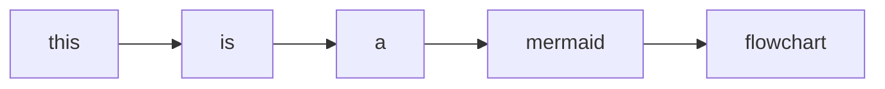
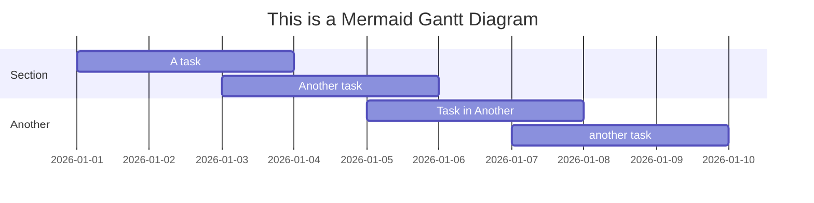

# Markdown test sheet


Tip: Viewing this in GitHub or latest version of Typora may give you the full features.

## Secondary heading

### Tertiary heading

Paragraph

What is ammonia? Ammonia is a gas with pungent smell. There are three hydrogen atoms bonded to a nitrogen atom. In water, ammonia accepts a proton to form ammonium ion (NH~4~^+^).

**This line is bold** (`<b>`).

*This line is italicized* (`<i>`).

***This line is bold and italicized.***

This is a link to [GitHub](https://github.com).

`This phrase` is in an inline code block; ==This== is highlighted; ~~This~~ is stroke-through; and this[^1] contains a footnote.


---


- This is an item in an unordered list.
- This is a second item in an unordered list.

1. This is an ordered list.
2. This is a second item in an ordered list.

> This is a quote block.
>
> > Nested quote block.
> >
> > > Another nested quote block.
> > >
> > > Another line in a nested quote block.
> >
> > Going back by one layer.

> [!note]
>
> This is a note.

> [!tip]
>
> This is a ~~basic~~ tip.

> [!warning]
>
> This is an ~~advanced~~ warning.

> [!caution]
>
> This is an ~~expert~~ caution.

> [!important]
>
> This is something ~~master~~ important.


---


This is an image of ソルト from external link.


| Col 1                             | Col 2                  |
| --------------------------------- | ---------------------- |
| This                              | is                     |
| a                                 | table                  |
| This cell<br />has multiple lines | So does<br />this cell |


```c++
#include <iostream>

int main(){
    int a = 0;
    for(int i=1; i<=100; i++) a += i;
    std::cout<<a<<"\n";
    std::cout<<"This is a code block.\n";
    return 0;
}
```








Math via $\mathrm{\LaTeX}$ (LaTeX):

Inline math: $e^{i\pi}-1=0$

Math block:
$$
\int_{0}^{1} x^2 \mathrm{d}x = \frac{1}{3}
$$

$$
\frac{1}{n} \sum_{i=0}^{n} x_i \geqslant \left(\prod_{i=0}^{n} x_i \right)^\frac{1}{n}
$$

---

[^1]: This is the corresponding footnote. The line above (if exists) is manually added.
